# System Architecture — Hotline Miami: VISEO Arcade Edition

This document details the architectural design, subsystems, data flow, and runtime mechanics of **Hotline Miami: VISEO Arcade Edition**.

---

## 1. High-Level Architecture

The game is structured into modular layers with zero external production dependencies, running entirely in modern web browsers via HTML5 Canvas 2D and the Web Audio API.

```mermaid
graph TD
    subgraph "Presentation & Canvas Layer"
        CANVAS[HTML5 Canvas 2D]
        POST[Post-Processing & Shaders<br/>CRT / Aberration / Vignette]
        CANVAS --> POST
    end

    subgraph "Core Orchestration (js/main.js)"
        LOOP[Game Loop<br/>requestAnimationFrame]
        FSM[Game State Machine<br/>MENU_TITLE / MENU_MASK / PLAYING / DEAD / SCORE]
        LOOP --> FSM
    end

    subgraph "Engine Services (js/engine/)"
        PHYS[Physics & Vectors]
        COLL[Collision & Raycasting]
        CAM[Dynamic Camera & Shake]
        INP[Input System<br/>Keyboard / Mouse / Gamepad]
        NAV[Pathfinding NavGraph]
    end

    subgraph "Entities (js/entities/)"
        PL[Player & Perks]
        EN[Enemy AI & Archetypes]
        WP[Weapon System & Arsenal]
        DR[Door Kinematics]
        SPW[Wave Spawner]
        ART[Procedural Character Art]
    end

    subgraph "Map & World (js/map/)"
        MD[Base Map Data]
        ML[Map Loader & IO<br/>maps/active.json]
        MR[Map Renderer & Floors]
        PR[Prop & Furniture Sprites]
        ED[In-Browser Map Editor]
    end

    subgraph "Audio Synthesis (js/audio/)"
        SYNTH[Synthwave Music Sequencer]
        SFX[Procedural Web Audio FX]
    end

    subgraph "Visual FX (js/effects/)"
        BLD[Persistent Blood System]
        PRT[Particle & Debris System]
    end

    subgraph "UI & Retro HUD (js/ui/)"
        MENU[Title / Characters / Controls / Audio / Credits / Tools / Pause]
        HUD[Neon HUD & Combos]
        SCR[Score Screen & Leaderboard]
    end

    FSM --> INP
    FSM --> CAM
    FSM --> PHYS
    FSM --> COLL
    FSM --> NAV
    FSM --> PL
    FSM --> EN
    FSM --> WP
    FSM --> DR
    FSM --> SPW
    FSM --> MR
    FSM --> SYNTH
    FSM --> SFX
    FSM --> BLD
    FSM --> PRT
    FSM --> HUD
    FSM --> SCR
    FSM --> MENU
    MR --> CANVAS
```

---

## 2. Subsystems & Module Breakdown

### 2.1 Game Loop & State Machine (`js/main.js`)
The master coordinator runs on standard `requestAnimationFrame` with delta-time clamping:
- **State Machine States:**
  - `MENU_TITLE`: Normal entry point; identity, four primary choices and bottom-right credits.
  - `MENU_CREDITS`: Dedicated Canvas role grid credited entirely to Targezed; back to title.
  - `MENU_MASK`: Character and animal mask selection screen.
  - `MENU_CONTROLS`: Keyboard/mouse and controller diagrams.
  - `MENU_AUDIO`: Persistent volume settings; returns to title or the frozen pause state.
  - `MENU_TOOLS`: Links to existing map selection and editor.
  - `PLAYING`: Core real-time combat and wave survival.
  - `INTERMISSION`: Brief cooldown between waves for repositioning and telegraphed spawns.
  - `DEAD`: Slow-motion death sequence with camera zoom, the screen-space `DeathOverlay`, a 220 ms input guard, and score access.
  - `GAME_OVER`: Final summary and grade display.
  - `PAUSED`: Pause state with full game state preservation.
- **Hit-Stop Slow Motion:** Brief fractional-second time freezes triggered during lethal melee impacts and door knockdowns to deliver visceral feedback.

### 2.2 Configuration & Constants (`js/config.js`)
Centralized parameter repository defining:
- Screen dimensions (1280x720 base resolution), camera lerp, and lookahead lead coefficients.
- The authentic 80s neon synthwave color palette (`NEON_PINK`, `NEON_CYAN`, `BLOOD_RED`, etc.).
- Complete profiles for the 7 playable VISEO employees with unique animal masks, stat modifiers, starting weapons, and lore.
- Full statistics for the 10-weapon arsenal (damage, range, fire rate, spread, bullet speed, recoil, noise radius, ammo capacity).
- Enemy archetypes and behavior constants.
- Multi-tier scoring formulas, combo timers, and letter grade thresholds.

### 2.3 Physics, Collision & Navigation (`js/engine/`)
- **Physics (`physics.js`):** Sub-stepped vector integration preventing tunneling. Custom circle-to-segment, circle-to-box, and circle-to-circle physics resolution.
- **Collision (`collision.js`):** Broad-phase and narrow-phase collision routines handling:
  - Solid perimeter and interior walls.
  - Fragile glass partitions (transparent to vision and bullets, blocking movement until shattered).
  - Rotated oriented bounding boxes (OBB) for angled desks and furniture.
  - Sampled player clearance grids (14-unit radius) for spawn and path verification.
- **Camera (`camera.js`):** Smooth lerping tracking the player with mouse/gamepad reticle lead, bounded by map limits, featuring an exponential trauma decay screen shake model.
- **Input (`input.js`):** Unified input layer supporting keyboard (WASD/ZQSD), mouse cursor aiming/clicking, and the standard W3C Gamepad API (dual analog sticks, trigger thresholds, button edge detection, and dual-motor haptic rumble).
- **Pathfinding (`pathfinding.js`):** NavGraph waypoint network with raycast line-of-sight checks, A* graph traversal, and waypoint smoothing for natural actor movement around office cubicles.

### 2.4 Entities & Combat Systems (`js/entities/`)
- **Player (`player.js`):** Controls actor locomotion, weapon equip states, throwing kinematics, and brutal ground execution sequences. Applies active mask perk multipliers.
- **Enemy AI (`enemy.js`):** Multi-archetype state machine (Patrol, Alert, Chase, Attack, Stunned, Dead) supporting:
  - `mobster_melee`: Swift melee attackers wielding pipes, bats, and knives.
  - `mobster_gun`: Armed thugs with pistols and uzis providing ranged suppression.
  - `dog`: High-speed quadrupeds with pounce mechanics and instantaneous reaction.
  - `shotgunner`: High-damage enforcers armed with pump shotguns firing 8-pellet spreads.
  - `heavy`: Armored brutes resistant to melee knockdowns requiring multiple hits or firearms.
- **Weapons (`weapon.js`):** Real-time weapon entity handling ammunition depletion, shell casing ejection, raycast/quasi-hitscan trajectories with spread, and projectile impact decals.
- **Doors (`door.js`, `js/map/doors.js`):** Physics-driven swinging door battants with angular velocity, rebound damping, and sweep collision. Distinguishes gentle movement pushes from combat kicks, inflicting knockdowns or lethal crushes (under Arnaud / Don Juan perk).
- **Wave Spawner (`spawner.js`):** Controls arcade wave progression, spawning enemies from designated elevator shafts and stairwells with telegraph countdown markers.
- **Character Art (`character_art.js`):** Procedural 2-pixel raster drawing routines for all actors, ensuring consistent pixel density and crisp visuals without external image assets.

### 2.5 Map System & In-Browser Editor (`js/map/`)
- **Base Map (`map_data.js`):** Authoritative geometric representation of the VISEO office floor plan (walls, glass partitions, doors, furniture, and zones).
- **Map Loader & IO (`map_loader.js`, `map_io.js`):** Hierarchical loading resolving `maps/active.json` -> browser `localStorage` draft -> authored base map.
- **Floor Layers (`map_renderer.js`):** Ordered polygon rendering with 8 distinct flooring materials (carpets, parquet, tiles) seamlessly integrated beneath room geometries.
- **Prop Sprites (`prop_sprites.js`):** 19 procedural office furniture sprites (desks, ergonomic chairs, sofas, potted plants, printers, water fountains) rendered with consistent lighting.
- **Map Editor (`map_editor.html`, `map_editor.js`):** Full-featured visual editor allowing non-destructive manipulation of walls, glass, doors, furniture, floor polygons, and spawn points with undo/redo and JSON export.

### 2.6 Audio & Visual FX (`js/audio/`, `js/effects/`)

Floating labels rasterize their outline/glow once per instance and animate the resulting bitmap. Victory fonts are warmed during menu initialization. Wave clear no longer adds its own 120 ms simulation hit-stop; normal combat impacts retain theirs. See [wave-transition profiling](wave-transition-performance.md) for the browser measurements and regression scenario.
- **Music Synthesizer (`synth_music.js`):** The original four-bar combat score is preserved first in a six-track rotation, followed by five 24-bar scores (120–132 BPM, under 49 seconds). Explicit note-name phrases follow each chord; bass figures select chord members instead of blindly transposing minor intervals. Pads release before the next chord. New leads use gentler resonance and cents-based vibrato while the original voice defaults remain intact. Tempo stays stable as intensity changes orchestration. Menu (100 BPM), wave-clear (92 BPM), and game-over (60 BPM) retain their four-bar schedules. Source tracking, short transition fades, cached percussion noise, background scheduler recovery and output headroom support playback. `test_music.js` checks original-score fingerprints, harmony, lifecycle, rotation and controls; optional `tools/render_music.cjs` exports and audits real browser Web Audio renders. See [music direction](music-direction.md).
- **Sound FX (`sound_effects.js`):** Dynamic sound generator synthesizing visceral gunshots, blade slashes, blunt impacts, door kicks, glass breaks, and execution sounds.
- **Gore & Blood (`blood.js`):** Dedicated off-screen blood canvas preserving persistent splatter decals, expanding pools under corpses, arterial sprays, and dismembered limbs.
- **Particles (`particles.js`):** Dynamic particle emitter handling muzzle flashes, sparks, bullet debris, smoke, and shattered glass fragments.
- **Post-Processor (`postprocess.js`):** Canvas post-processing pipeline emulating 80s cathode-ray tube (CRT) monitors with scanlines, chromatic aberration, curvature, and bloom.

### 2.7 UI & Scoring (`js/ui/`)
- **Canvas menus (`ui_theme.js`):** Shared palette, hard text shadows, procedural city background and uniform 1280×720 safe-area transform. `CanvasMenu` polls keyboard, gamepad and mouse once per frame, using the same coordinates for painting and hit-testing. State changes consume the current input frame.
- **Title (`title_menu.js`):** Dedicated launch state, logo settles in 480 ms, options enter in less than 500 ms; animated skyline fills wider or taller viewports.
- **Credits (`credits_menu.js`):** Bottom-right title entry, fifteen roles attributed to Targezed, shared three-column layout and standard return navigation.
- **Characters (`mask_menu.js`):** One featured portrait and seven names; existing character data and loadouts, session selection preserved on return.
- **Controls / audio / tools / pause:** Dedicated components. Audio settings clamp and validate persisted values, fall back to session memory when storage is unavailable, and use the same music/SFX singletons captured by entity modules. Death ducking scales the saved music volume; new runs and menus restore it. Pause remembers PLAYING versus INTERMISSION. See [menu direction](menu-direction.md).
- **HUD (`hud.js`):** Event-driven retro arcade HUD displaying the exact score, combo multiplier and decay, wave metadata, active weapon ammo, short event impacts, transient mask feedback, and floating combat score text. Presentation timers use real time while combo decay remains simulation-time based, so hit-stop does not stretch visual feedback or alter scoring.
- **Death Overlay (`death_overlay.js`):** Screen-space death presentation with blood textures generated and cached once per death, local `SELINCAH` font, neutral veil/vignette, delayed score hint, and no HUD on the lethal frame. `main.js` retains ownership of state transitions, input priority, retry guards, and score access.
- **Score Screen (`score_screen.js`):** Post-run breakdown grading performance from D to S (Apex Psychopath), calculating bonuses for weapon variety, bold combos, carnage, and clear time, with a local V2 leaderboard.

---

## 3. Playable Roster & Character Matrix

| Character | Animal | Role | Starting Loadout | Signature Perk |
|-----------|--------|------|------------------|----------------|
| **Vincent** | Lion | Agency Director | Magnum (.44, 4 rounds) | Executions 25% faster; firearm ammo capacity -25% |
| **Anne** | Panther | Business Developer | Combat Knife | Movement speed +20%; firearm ammo capacity -25% |
| **Lucas** | Wolf | Sales Representative | Uzi (20 rounds) | Fire delay -15%; bullet spread +25% |
| **Arnaud** | Bear | Manager | Pump Shotgun (6 shells) | Door impacts are lethal to ordinary enemies; movement speed -20% |
| **Jade** | Swan | Talent Acquisition | Silenced Pistol (12 rounds) | Combo window +50%; fire delay +15% |
| **PAP** | Owl | IT Support Manager | Baseball Bat | Kill score +50%; movement speed -15% |
| **JC** | Cobra | CISO | M16 Rifle (24 rounds) | Bullet spread -45%; fire delay +20% |

---

## 4. Testing & Verification Framework

The codebase includes 21 automated regression test suites executed via Node.js (`npm test` / `node tools/test.cjs`):
- `test_arcade_waves.js`: Wave progression, enemy ingress routes, and boundary safety.
- `test_character_gait.js`: Procedural leg movement, strafing gait, and torso orientation.
- `test_character_roster.js`: Stats, starting loadouts, perks, and ammo caps for all 7 characters.
- `test_collision_passages.js`: Wall/glass/door collision at 10, 30, 60, and 144 FPS.
- `test_combat_ai.js`: Comprehensive combat integration, enemy line-of-sight, and AI behaviors.
- `test_difficulty_tuning.js`: Spawn telegraphs, initial miss heuristics, and glass shattering.
- `test_door_safety.js`: Door sweep kinematics, stun recovery, and transition triggers.
- `test_engine.js`: Map bounds, NavGraph node connectivity, raycasting, and door physics.
- `test_final_regressions.js`: Camera trauma decay, determinism, weapon speed, and HUD layering.
- `test_floor_layers.js`: Floor polygon persistence, ordering, and migration integrity.
- `test_gamepad.js`: Complete 10-test Gamepad API verification (analog sticks, triggers, haptics).
- `test_interaction_guards.js`: Obstacle interaction safety and actor spacing.
- `test_map_files.js`: JSON schema compatibility (v1/v2) and active map isolation.
- `test_map_plan.js`: Architectural accuracy against reference office blueprints.
- `test_menu_navigation.js`: Real InputManager keyboard/gamepad edges, selection/back paths, uniform viewport hit-testing and robust audio persistence. Optional `tools/validate_menus.cjs` exercises the browser state machine and exports four-resolution captures.
- `test_music.js`: Original combat score fingerprint preservation, 6-track harmonic compatibility, note registers, voice release lifecycles, and audio volume/mute controls.
- `test_player_reach.js`: Melee swing arcs and frame-rate-independent weapon throws.
- `test_rotated_furniture.js`: OBB collision detection for rotated desks and furniture.
- `test_scoring.js`: Multipliers, combos, bonuses, leaderboard persistence, and corrupt storage recovery.
- `test_scoring_events.js`: Event deduplication for thrown weapon kills and melee stuns.
- `test_visual_pipeline.js`: Visual asset contracts, sprite caching, and canvas dimensions.

---

## 5. Automated CI/CD & GitHub Pages Deployment

The repository is configured for automated deployment to GitHub Pages via GitHub Actions:
- **Workflow (`.github/workflows/deploy.yml`):** Automatically triggered on every push to the `main` branch or manual dispatch.
- **Automated Validation:** Runs `npm test` across all 21 test suites prior to artifact creation.
- **Zero-Build Packaging:** Uploads static web assets directly (`index.html`, `css/`, `js/`, `maps/`, asset images) using `actions/upload-pages-artifact@v3`.
- **Atomic Deployment:** Deploys via `actions/deploy-pages@v4` with GitHub Pages environment tracking.
- **Static Hosting Guarantees:** Includes `.nojekyll` to bypass Jekyll filters, and strict relative URI resolution ensuring flawless execution under subpaths such as `https://tar-gezed.github.io/hotline-viseo/`.

